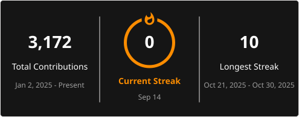

  
  

<h1 align="center">Nolan Heriniaina</h1>

  Développeur Full-Stack &nbsp;·&nbsp; Remote Freelance &nbsp;·&nbsp; 6 ans d'expérience

---

### À propos

Freelance full-stack depuis 6 ans, je travaille en remote sur des projets web et mobile de bout en bout — du brief initial à la mise en production.

Ce qui m'intéresse, c'est le problème à résoudre : parfois technique, parfois architectural, parfois juste trouver la bonne façon de livrer ce que le client attend vraiment.

---

### Stack principale

| Front | Back | Mobile | DevOps |
|-------|------|--------|--------|
| Next.js, React 18, TypeScript, Tailwind | Laravel, Node.js, Supabase, Strapi | React Native, Ionic, Capacitor | Vercel, Docker, AWS S3, CI/CD |

---

### Projets marquants

**Plateforme hôtelière** — négociation de prix en temps réel (Supabase Realtime, SSR Next.js)

**App patrimoine historique** — 3D gyroscope, mini-jeux, plan interactif (iOS/Android)

**Réseau social événements** — chat temps réel, billets QR code, Apple/Google Wallet

**Plugin de caisse WooCommerce** — stocks, facturation, comptabilité (PHP 8 custom)

---

**Disponible** pour missions freelance remote ou poste full-stack si le projet est intéressant.
`nolanheriniaina.dev@gmail.com`
